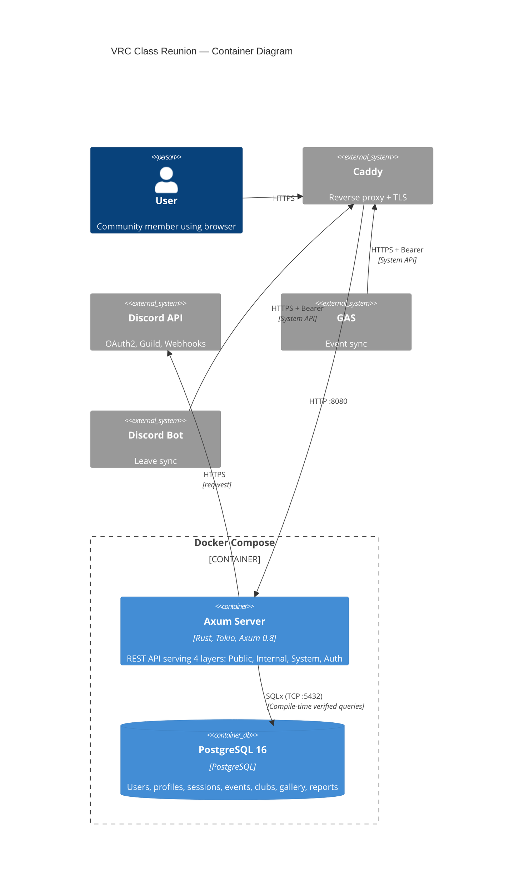

# Container Diagram (C4 Level 2)

## Diagram



## Container Responsibilities

### Axum Server (`vrc-backend`)

| Concern | Implementation |
|---------|---------------|
| HTTP framework | Axum 0.8 with Tower middleware stack |
| Async runtime | Tokio multi-threaded (default worker count = CPU cores) |
| Database access | SQLx 0.8 (PostgreSQL driver, compile-time query verification) |
| HTTP client | `reqwest` for Discord API calls |
| Serialization | `serde` + `serde_json` (zero-copy deserialization on hot paths) |
| Markdown rendering | `pulldown-cmark` → HTML → `ammonia` sanitization |
| Rate limiting | `governor` crate (in-memory, keyed by IP or user ID) |
| Session management | Custom implementation (DB-backed, UUID session IDs) |
| Background tasks | Tokio `spawn` for session cleanup, event archival, member sync |
| Logging | `tracing` + `tracing-subscriber` (JSON format) |
| Metrics | `metrics` + `metrics-exporter-prometheus` |
| Global allocator | `tikv-jemallocator` for reduced fragmentation |

### PostgreSQL 16

| Concern | Notes |
|---------|-------|
| Version | 16.x (latest stable) |
| Extensions | None required (standard feature set sufficient) |
| Connection pooling | SQLx built-in pool (max 10 connections, configurable) |
| Encoding | UTF-8 |
| Locale | C (for consistent sorting behavior) |

## Internal Architecture (Hexagonal)

```
┌─────────────────────────────────────────────────┐
│                  Axum Server                      │
│                                                   │
│  ┌─────────────┐  ┌──────────────────────────┐   │
│  │   Adapters   │  │        Domain Core        │   │
│  │  (inbound)   │  │                          │   │
│  │             │  │  ┌────────┐ ┌──────────┐ │   │
│  │ HTTP Routes ├──┤  │Use Cases│ │ Entities │ │   │
│  │ (Axum)     │  │  │        │ │          │ │   │
│  │             │  │  └───┬────┘ └──────────┘ │   │
│  └─────────────┘  │      │                    │   │
│                    │  ┌───▼──────┐            │   │
│  ┌─────────────┐  │  │  Ports   │            │   │
│  │   Adapters   │  │  │ (traits) │            │   │
│  │  (outbound)  │  │  └───┬──────┘            │   │
│  │             │  └───────┼───────────────────┘   │
│  │ PostgreSQL  ◄──────────┘                       │
│  │ (SQLx)     │                                   │
│  │             │                                   │
│  │ Discord API │                                   │
│  │ (reqwest)   │                                   │
│  │             │                                   │
│  │ Webhook     │                                   │
│  │ (reqwest)   │                                   │
│  └─────────────┘                                   │
└─────────────────────────────────────────────────┘
```

### Module Structure (Crate Layout)

```
src/
├── main.rs                          # Entry point: config, DI wiring, server start
├── lib.rs                           # Re-exports for integration tests
│
├── config/
│   ├── mod.rs                       # AppConfig struct, env parsing, validation
│   └── secrets.rs                   # Secret types (Display redacted, Zeroize on drop)
│
├── domain/                          # === DOMAIN CORE (no external dependencies) ===
│   ├── mod.rs
│   ├── entities/
│   │   ├── mod.rs
│   │   ├── user.rs                  # User, UserId, UserRole, UserStatus
│   │   ├── profile.rs               # Profile, ProfileSummary, Bio
│   │   ├── session.rs               # Session, SessionId
│   │   ├── event.rs                 # Event, EventId, EventStatus, EventTag
│   │   ├── club.rs                  # Club, ClubId
│   │   ├── gallery.rs               # GalleryImage, GalleryImageStatus
│   │   └── report.rs                # Report, ReportId, ReportTargetType, ReportStatus
│   ├── value_objects/
│   │   ├── mod.rs
│   │   ├── discord_id.rs            # DiscordId (newtype, validated)
│   │   ├── vrc_id.rs                # VrcId (newtype, validated)
│   │   ├── x_id.rs                  # XId (newtype, regex-validated)
│   │   ├── markdown.rs              # SanitizedMarkdown, RenderedHtml
│   │   └── pagination.rs            # PageRequest, PageResponse<T>
│   ├── ports/                       # === PORTS (trait definitions) ===
│   │   ├── mod.rs
│   │   ├── repositories/
│   │   │   ├── mod.rs
│   │   │   ├── user_repository.rs   # trait UserRepository
│   │   │   ├── profile_repository.rs
│   │   │   ├── session_repository.rs
│   │   │   ├── event_repository.rs
│   │   │   ├── club_repository.rs
│   │   │   ├── gallery_repository.rs
│   │   │   └── report_repository.rs
│   │   ├── services/
│   │   │   ├── mod.rs
│   │   │   ├── discord_client.rs    # trait DiscordClient (OAuth2, guild check)
│   │   │   ├── webhook_sender.rs    # trait WebhookSender
│   │   │   └── markdown_renderer.rs # trait MarkdownRenderer
│   │   └── clock.rs                 # trait Clock (for testable time)
│   └── use_cases/
│       ├── mod.rs
│       ├── auth/
│       │   ├── login.rs             # StartOAuthFlow, HandleCallback
│       │   ├── logout.rs            # DestroySession
│       │   ├── me.rs                # GetCurrentUser
│       │   └── bootstrap.rs         # BootstrapSuperAdmin
│       ├── profile/
│       │   ├── get_profile.rs       # GetMyProfile, GetPublicProfile
│       │   ├── update_profile.rs    # UpsertProfile
│       │   └── list_members.rs      # ListPublicMembers
│       ├── event/
│       │   ├── sync_event.rs        # UpsertEventFromExternal
│       │   ├── list_events.rs       # ListEvents (public + internal)
│       │   └── archive_events.rs    # ArchivePastEvents
│       ├── club/
│       │   ├── create_club.rs       # CreateClub
│       │   ├── list_clubs.rs        # ListClubs, GetClub
│       │   └── gallery.rs           # UploadGalleryImage, UpdateGalleryStatus, ListGallery
│       ├── moderation/
│       │   └── report.rs            # CreateReport
│       ├── admin/
│       │   ├── list_users.rs        # ListUsersAdmin
│       │   └── change_role.rs       # ChangeUserRole
│       └── system/
│           └── member_leave.rs      # HandleMemberLeave
│
├── adapters/                        # === ADAPTERS (concrete implementations) ===
│   ├── mod.rs
│   ├── inbound/                     # HTTP layer (Axum routes + extractors)
│   │   ├── mod.rs
│   │   ├── routes/
│   │   │   ├── mod.rs               # Router composition
│   │   │   ├── public.rs            # Public API routes
│   │   │   ├── internal.rs          # Internal API routes
│   │   │   ├── system.rs            # System API routes
│   │   │   ├── auth.rs              # Auth API routes
│   │   │   └── health.rs            # Health check + metrics
│   │   ├── extractors/
│   │   │   ├── mod.rs
│   │   │   ├── session.rs           # AuthenticatedUser<R: Role> extractor
│   │   │   ├── pagination.rs        # ValidatedPagination extractor
│   │   │   └── json.rs              # ValidatedJson<T> extractor
│   │   ├── middleware/
│   │   │   ├── mod.rs
│   │   │   ├── rate_limit.rs        # RateLimitLayer (governor-based)
│   │   │   ├── cors.rs              # CorsLayer configuration
│   │   │   ├── csrf.rs              # CsrfLayer (Origin check)
│   │   │   ├── request_id.rs        # RequestIdLayer
│   │   │   ├── cache_control.rs     # CacheControlLayer
│   │   │   └── logging.rs           # RequestLoggingLayer
│   │   └── responses/
│   │       ├── mod.rs
│   │       ├── error.rs             # ApiError → HTTP response mapping
│   │       └── pagination.rs        # Paginated<T> response helper
│   └── outbound/                    # External service implementations
│       ├── mod.rs
│       ├── postgres/
│       │   ├── mod.rs               # PostgreSQL adapter module
│       │   ├── user_repo.rs         # impl UserRepository for PgUserRepository
│       │   ├── profile_repo.rs
│       │   ├── session_repo.rs
│       │   ├── event_repo.rs
│       │   ├── club_repo.rs
│       │   ├── gallery_repo.rs
│       │   └── report_repo.rs
│       ├── discord/
│       │   ├── mod.rs
│       │   └── client.rs            # impl DiscordClient for ReqwestDiscordClient
│       ├── webhook/
│       │   ├── mod.rs
│       │   └── sender.rs            # impl WebhookSender for DiscordWebhookSender
│       └── markdown/
│           ├── mod.rs
│           └── renderer.rs          # impl MarkdownRenderer for PulldownCmarkRenderer
│
├── auth/                            # === TYPE-STATE AUTHORIZATION ===
│   ├── mod.rs
│   ├── roles.rs                     # Phantom types: Member, Staff, Admin, SuperAdmin
│   ├── permission.rs                # Role hierarchy + permission checks
│   └── extractor.rs                 # AuthenticatedUser<R> — compile-time role enforcement
│
├── errors/                          # === ERROR ALGEBRA ===
│   ├── mod.rs
│   ├── domain.rs                    # DomainError (business rule violations)
│   ├── api.rs                       # ApiError (HTTP-facing, with error codes)
│   ├── infrastructure.rs            # InfraError (DB, network, Discord)
│   └── codes.rs                     # ErrorCode enum → "ERR-XXXX-NNN" strings
│
├── background/                      # === BACKGROUND TASKS ===
│   ├── mod.rs
│   ├── session_cleanup.rs           # Periodic expired session deletion
│   ├── event_archival.rs            # Periodic past event archival
│   └── scheduler.rs                 # Task scheduler (tokio::spawn + interval)
│
└── macros/                          # === PROCEDURAL MACROS (separate crate) ===
    └── (see vrc-macros crate)

# Separate crate: vrc-macros/
vrc-macros/
├── Cargo.toml                       # proc-macro = true
├── src/
│   └── lib.rs                       # #[handler], #[require_role], derive macros
```
