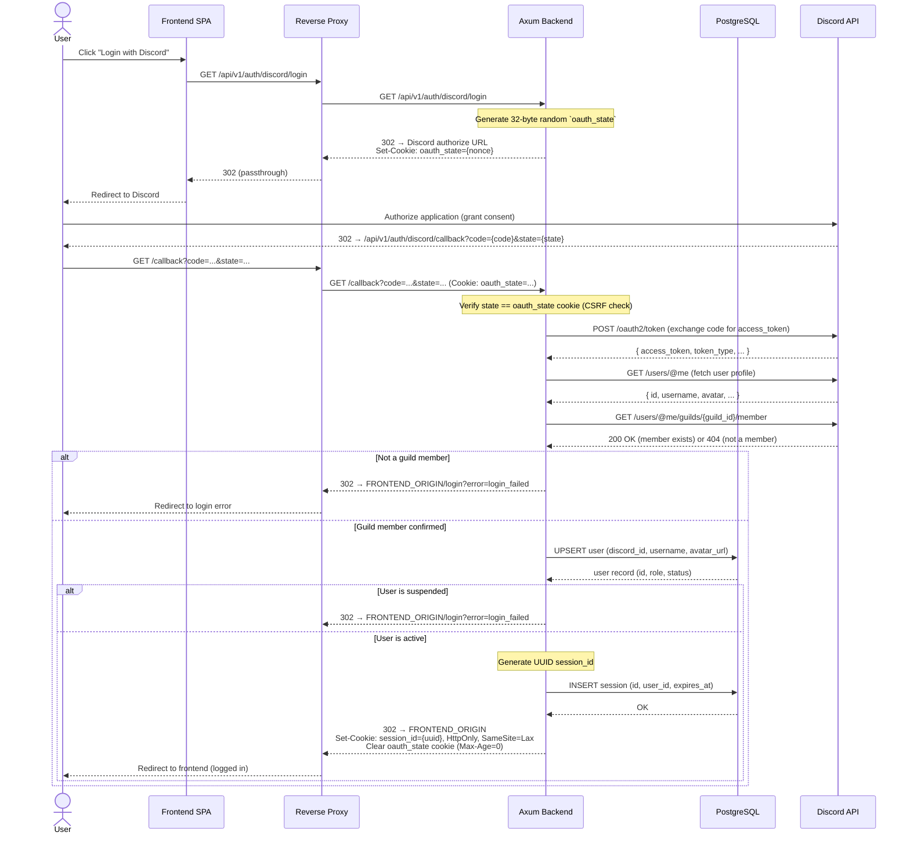
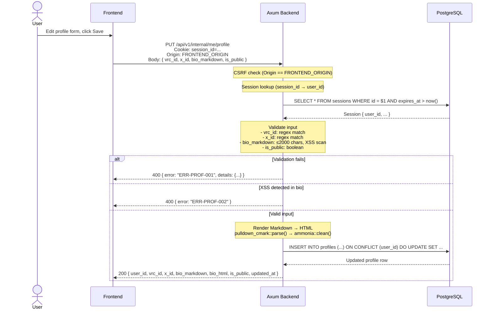
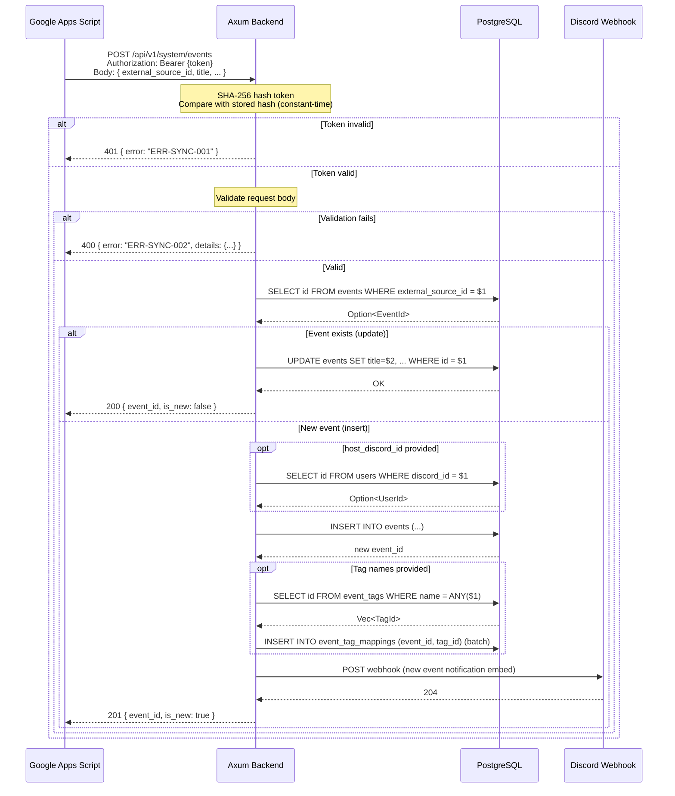
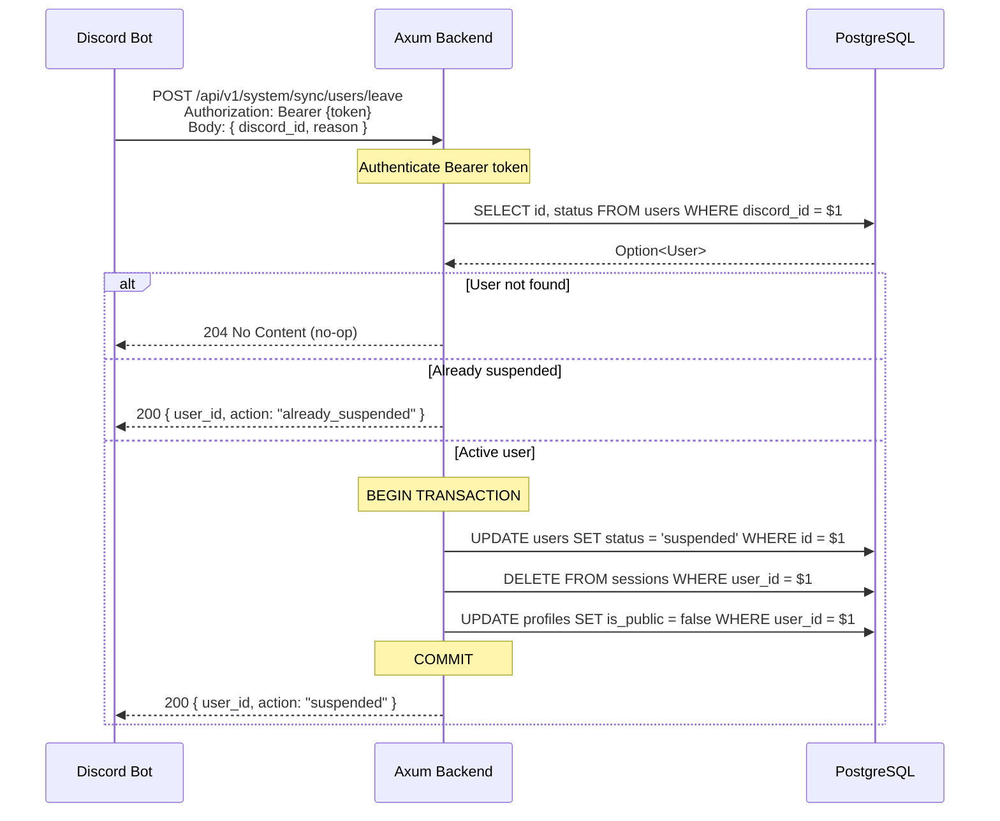

# Data Flow

## Critical Data Flows

### Flow 1: Discord OAuth2 Login

```mermaid
sequenceDiagram
    actor User
    participant FE as Frontend SPA
    participant Caddy as Reverse Proxy
    participant BE as Axum Backend
    participant DB as PostgreSQL
    participant Discord as Discord API

    User->>FE: Click "Login with Discord"
    FE->>Caddy: GET /api/v1/auth/discord/login
    Caddy->>BE: GET /api/v1/auth/discord/login

    Note over BE: Generate 32-byte random `oauth_state`
    BE-->>Caddy: 302 → Discord authorize URL<br/>Set-Cookie: oauth_state={nonce}
    Caddy-->>FE: 302 (passthrough)
    FE-->>User: Redirect to Discord

    User->>Discord: Authorize application (grant consent)
    Discord-->>User: 302 → /api/v1/auth/discord/callback?code={code}&state={state}
    User->>Caddy: GET /callback?code=...&state=...
    Caddy->>BE: GET /callback?code=...&state=... (Cookie: oauth_state=...)

    Note over BE: Verify state == oauth_state cookie (CSRF check)

    BE->>Discord: POST /oauth2/token (exchange code for access_token)
    Discord-->>BE: { access_token, token_type, ... }

    BE->>Discord: GET /users/@me (fetch user profile)
    Discord-->>BE: { id, username, avatar, ... }

    BE->>Discord: GET /users/@me/guilds/{guild_id}/member
    Discord-->>BE: 200 OK (member exists) or 404 (not a member)

    alt Not a guild member
        BE-->>Caddy: 302 → FRONTEND_ORIGIN/login?error=login_failed
        Caddy-->>User: Redirect to login error
    else Guild member confirmed
        BE->>DB: UPSERT user (discord_id, username, avatar_url)
        DB-->>BE: user record (id, role, status)

        alt User is suspended
            BE-->>Caddy: 302 → FRONTEND_ORIGIN/login?error=login_failed
        else User is active
            Note over BE: Generate UUID session_id
            BE->>DB: INSERT session (id, user_id, expires_at)
            DB-->>BE: OK

            BE-->>Caddy: 302 → FRONTEND_ORIGIN<br/>Set-Cookie: session_id={uuid}, HttpOnly, SameSite=Lax<br/>Clear oauth_state cookie (Max-Age=0)
            Caddy-->>User: Redirect to frontend (logged in)
        end
    end
```

### Flow 2: Profile Update

```mermaid
sequenceDiagram
    actor User
    participant FE as Frontend
    participant BE as Axum Backend
    participant DB as PostgreSQL

    User->>FE: Edit profile form, click Save
    FE->>BE: PUT /api/v1/internal/me/profile<br/>Cookie: session_id=...<br/>Origin: FRONTEND_ORIGIN<br/>Body: { vrc_id, x_id, bio_markdown, is_public }

    Note over BE: CSRF check (Origin == FRONTEND_ORIGIN)
    Note over BE: Session lookup (session_id → user_id)

    BE->>DB: SELECT * FROM sessions WHERE id = $1 AND expires_at > now()
    DB-->>BE: Session { user_id, ... }

    Note over BE: Validate input<br/>- vrc_id: regex match<br/>- x_id: regex match<br/>- bio_markdown: ≤2000 chars, XSS scan<br/>- is_public: boolean

    alt Validation fails
        BE-->>FE: 400 { error: "ERR-PROF-001", details: {...} }
    else XSS detected in bio
        BE-->>FE: 400 { error: "ERR-PROF-002" }
    else Valid input
        Note over BE: Render Markdown → HTML<br/>pulldown_cmark::parse() → ammonia::clean()

        BE->>DB: INSERT INTO profiles (...) ON CONFLICT (user_id) DO UPDATE SET ...
        DB-->>BE: Updated profile row

        BE-->>FE: 200 { user_id, vrc_id, x_id, bio_markdown, bio_html, is_public, updated_at }
    end
```

### Flow 3: Event Sync from GAS

```mermaid
sequenceDiagram
    participant GAS as Google Apps Script
    participant BE as Axum Backend
    participant DB as PostgreSQL
    participant Discord as Discord Webhook

    GAS->>BE: POST /api/v1/system/events<br/>Authorization: Bearer {token}<br/>Body: { external_source_id, title, ... }

    Note over BE: SHA-256 hash token<br/>Compare with stored hash (constant-time)

    alt Token invalid
        BE-->>GAS: 401 { error: "ERR-SYNC-001" }
    else Token valid
        Note over BE: Validate request body

        alt Validation fails
            BE-->>GAS: 400 { error: "ERR-SYNC-002", details: {...} }
        else Valid
            BE->>DB: SELECT id FROM events WHERE external_source_id = $1
            DB-->>BE: Option<EventId>

            alt Event exists (update)
                BE->>DB: UPDATE events SET title=$2, ... WHERE id = $1
                DB-->>BE: OK
                BE-->>GAS: 200 { event_id, is_new: false }
            else New event (insert)
                opt host_discord_id provided
                    BE->>DB: SELECT id FROM users WHERE discord_id = $1
                    DB-->>BE: Option<UserId>
                end
                BE->>DB: INSERT INTO events (...)
                DB-->>BE: new event_id

                opt Tag names provided
                    BE->>DB: SELECT id FROM event_tags WHERE name = ANY($1)
                    DB-->>BE: Vec<TagId>
                    BE->>DB: INSERT INTO event_tag_mappings (event_id, tag_id) (batch)
                end

                BE->>Discord: POST webhook (new event notification embed)
                Discord-->>BE: 204

                BE-->>GAS: 201 { event_id, is_new: true }
            end
        end
    end
```

### Flow 4: Member Leave (Atomic Suspension)

```mermaid
sequenceDiagram
    participant Bot as Discord Bot
    participant BE as Axum Backend
    participant DB as PostgreSQL

    Bot->>BE: POST /api/v1/system/sync/users/leave<br/>Authorization: Bearer {token}<br/>Body: { discord_id, reason }

    Note over BE: Authenticate Bearer token

    BE->>DB: SELECT id, status FROM users WHERE discord_id = $1
    DB-->>BE: Option<User>

    alt User not found
        BE-->>Bot: 204 No Content (no-op)
    else Already suspended
        BE-->>Bot: 200 { user_id, action: "already_suspended" }
    else Active user
        Note over BE: BEGIN TRANSACTION
        BE->>DB: UPDATE users SET status = 'suspended' WHERE id = $1
        BE->>DB: DELETE FROM sessions WHERE user_id = $1
        BE->>DB: UPDATE profiles SET is_public = false WHERE user_id = $1
        Note over BE: COMMIT

        BE-->>Bot: 200 { user_id, action: "suspended" }
    end
```
