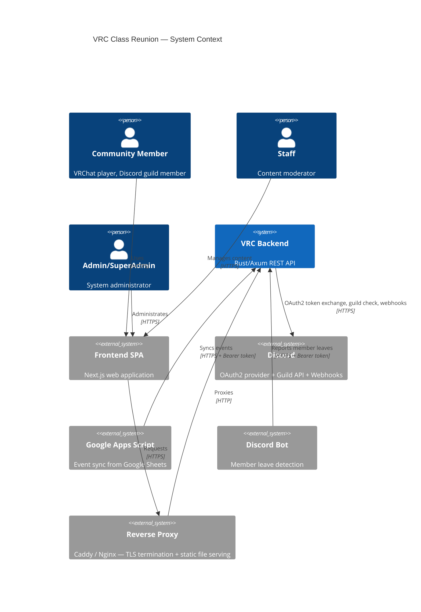

# System Context (C4 Level 1)

## Diagram

## Description

The **VRC Backend** is a monolithic Rust/Axum REST API that serves as the single backend for the VRChat October Class Reunion community website. It exposes four API layers:

1. **Public API** — Unauthenticated, cached reads (members, events, clubs, gallery)
2. **Internal API** — Session-authenticated BFF operations (profile editing, moderation, admin)
3. **System API** — Bearer-token M2M (event sync from GAS, member leave from Bot)
4. **Auth API** — Discord OAuth2 login flow

The backend communicates with:
- **Discord** for OAuth2 authentication, guild membership verification, and webhook notifications
- **PostgreSQL** as the sole persistent data store
- **Reverse Proxy** (Caddy) for TLS termination, HTTP/3, and serving gallery images from local storage
- **Local Filesystem** — Gallery images stored in a Docker volume on the Proxmox VM

The frontend is a separate SPA that communicates via the reverse proxy. Gallery images are uploaded through the backend and stored locally on the server filesystem.
