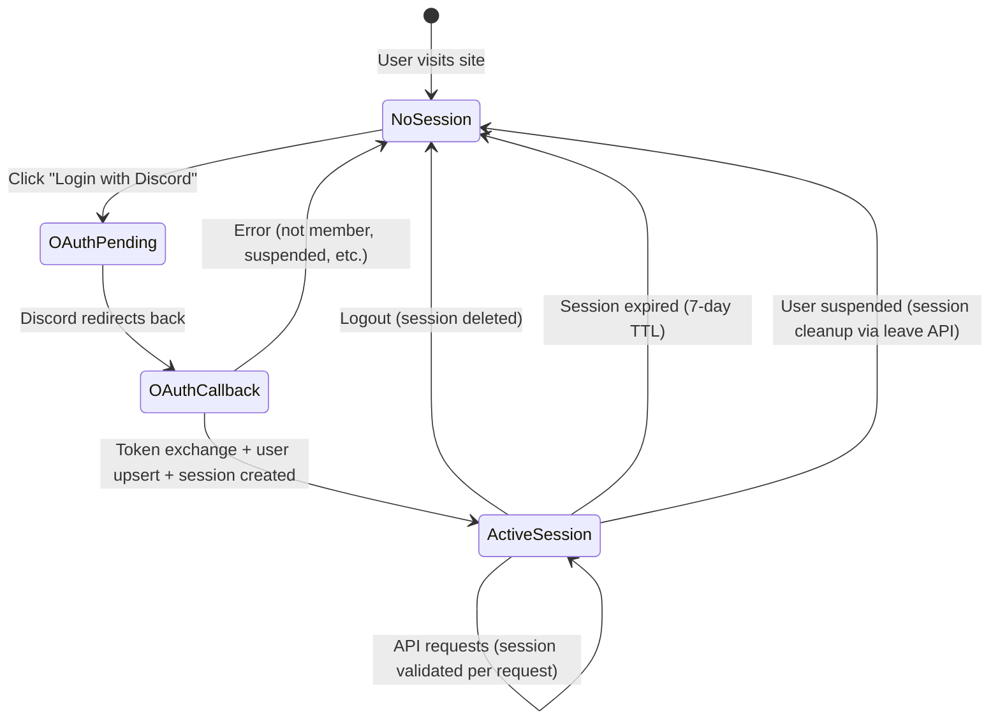

# Authentication Design

## Session Lifecycle



## Session Token Contract

| Property | Specification |
|----------|---------------|
| **Generation** | 32 bytes from `ring::rand::SystemRandom` (OS CSPRNG) |
| **Encoding** | Base64url (no padding) = 43 chars |
| **Storage** | SHA-256 hash stored in `sessions.token_hash` (BYTEA, 32 bytes) |
| **Transport** | `session_id` cookie only (never in URL, header, or response body) |
| **Cookie flags** | `HttpOnly; Secure; SameSite=Lax; Path=/; Max-Age=604800` |
| **Lifetime** | 7 days from creation (no sliding window — fixed expiry) |
| **Validation** | SHA-256(cookie_value) → lookup `sessions.token_hash` → check `expires_at > NOW()` |
| **Revocation** | `DELETE FROM sessions WHERE token_hash = $1` (immediate, single query) |
| **Bulk revocation** | `DELETE FROM sessions WHERE user_id = $1` (used by leave/suspend flows) |

## Why SHA-256 Hashed Storage?

If an attacker gains read access to the `sessions` table (e.g., SQL injection, backup leak, DB compromise), they get SHA-256 hashes. SHA-256 is a one-way function — they cannot reconstruct the original 32-byte random token from the hash. Therefore:

- DB breach does NOT compromise active sessions
- Attacker cannot forge session cookies
- This is the same pattern used by GitHub, GitLab, and other major platforms

## Session Validation Flow (Per Request)

```rust
pub async fn validate_session(
    cookie_jar: &CookieJar,
    db: &PgPool,
) -> Result<(User, Session), DomainError> {
    // 1. Extract raw token from cookie
    let raw_token = cookie_jar
        .get("session_id")
        .ok_or(DomainError::SessionInvalid)?
        .value();

    // 2. Decode base64url → 32 bytes
    let token_bytes = base64url_decode(raw_token)
        .map_err(|_| DomainError::SessionInvalid)?;

    // 3. SHA-256 hash
    let token_hash = sha256(&token_bytes);

    // 4. Lookup session + join user
    let row = sqlx::query_as!(
        SessionWithUser,
        r#"
        SELECT s.id, s.user_id, s.expires_at,
               u.discord_id, u.discord_display_name, u.discord_avatar_hash,
               u.role as "role: UserRole", u.status as "status: UserStatus",
               u.joined_at
        FROM sessions s
        JOIN users u ON u.id = s.user_id
        WHERE s.token_hash = $1 AND s.expires_at > NOW()
        "#,
        &token_hash[..]
    )
    .fetch_optional(db)
    .await
    .map_err(InfraError::Database)?
    .ok_or(DomainError::SessionInvalid)?;

    // 5. Check user status
    if row.status == UserStatus::Suspended {
        return Err(DomainError::AccountSuspended);
    }

    Ok((row.into_user(), row.into_session()))
}
```

## OAuth2 State Token Security

| Property | Specification |
|----------|---------------|
| **Payload** | `{nonce: [u8; 32], redirect_to: String, expires_at: DateTime}` |
| **Serialization** | JSON → Base64url |
| **Signing** | HMAC-SHA256 with `SESSION_SECRET` as key |
| **Format** | `<base64url_payload>.<base64url_signature>` |
| **Nonce storage** | `oauth_state` HttpOnly cookie (Max-Age=600s) |
| **Validation** | Verify signature → check expiry → compare nonce with cookie |

This prevents:
- **CSRF on OAuth callback**: Nonce in cookie must match nonce in state
- **Open redirect**: `redirect_to` is signed — tampering breaks the signature
- **Replay attacks**: 10-minute expiry + one-time code usage by Discord

## Redirect Validation

The `redirect_to` parameter from login is validated:
1. Must be a relative path (starts with `/`)
2. Must not contain `//` (prevents protocol-relative URLs)
3. Must not contain `\` (prevents URL manipulation)
4. Must not contain control characters
5. Default: `/` if not provided or validation fails

```rust
fn validate_redirect(path: &str) -> &str {
    if path.starts_with('/')
        && !path.contains("//")
        && !path.contains('\\')
        && path.chars().all(|c| !c.is_control())
    {
        path
    } else {
        "/"
    }
}
```

## Session Cleanup

Expired sessions are cleaned up via a periodic background task:

```rust
// Runs every 1 hour
async fn cleanup_expired_sessions(db: &PgPool) {
    let deleted = sqlx::query!("DELETE FROM sessions WHERE expires_at < NOW()")
        .execute(db)
        .await;
    tracing::info!(deleted = ?deleted, "Expired sessions cleaned up");
}
```

This is a lightweight query that benefits from the `idx_sessions_expires_at` index.
