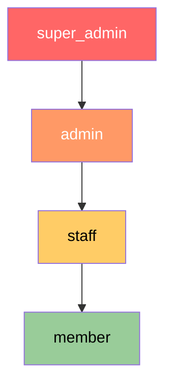

# Authorization Design

## Role Hierarchy



Roles are strictly ordered: `super_admin > admin > staff > member`. A higher role inherits all permissions of lower roles.

## Permission Matrix

| Action | member | staff | admin | super_admin |
|--------|--------|-------|-------|-------------|
| View public endpoints | ✅ | ✅ | ✅ | ✅ |
| View own profile | ✅ | ✅ | ✅ | ✅ |
| Update own profile | ✅ | ✅ | ✅ | ✅ |
| Submit report | ✅ | ✅ | ✅ | ✅ |
| View extended event info | ✅ | ✅ | ✅ | ✅ |
| Create club | ❌ | ✅ | ✅ | ✅ |
| Upload gallery image | ❌ | ✅ | ✅ | ✅ |
| Approve/reject gallery | ❌ | ✅ | ✅ | ✅ |
| List all users (admin view) | ❌ | ❌ | ✅ | ✅ |
| Change user role → member/staff | ❌ | ❌ | ✅ | ✅ |
| Change user role → admin | ❌ | ❌ | ❌ | ✅ |
| Change user role → super_admin | ❌ | ❌ | ❌ | ✅ |
| Modify super_admin user | ❌ | ❌ | ❌ | ✅ |

## Type-State Authorization Implementation

The authorization system uses Rust's type system to enforce role requirements at compile time.

### Role Marker Types

```rust
/// Marker traits for authorization levels
pub trait Role: Send + Sync + 'static {
    const LEVEL: u8;
    const NAME: &'static str;
}

pub struct Member;
pub struct Staff;  
pub struct Admin;
pub struct SuperAdmin;

impl Role for Member     { const LEVEL: u8 = 0; const NAME: &'static str = "member"; }
impl Role for Staff      { const LEVEL: u8 = 1; const NAME: &'static str = "staff"; }
impl Role for Admin      { const LEVEL: u8 = 2; const NAME: &'static str = "admin"; }
impl Role for SuperAdmin { const LEVEL: u8 = 3; const NAME: &'static str = "super_admin"; }

/// Compile-time role satisfaction check
pub trait SatisfiesRole<Required: Role>: Role {}

// Every role satisfies itself and lower roles
impl SatisfiesRole<Member> for Member {}
impl SatisfiesRole<Member> for Staff {}
impl SatisfiesRole<Member> for Admin {}
impl SatisfiesRole<Member> for SuperAdmin {}
impl SatisfiesRole<Staff> for Staff {}
impl SatisfiesRole<Staff> for Admin {}
impl SatisfiesRole<Staff> for SuperAdmin {}
impl SatisfiesRole<Admin> for Admin {}
impl SatisfiesRole<Admin> for SuperAdmin {}
impl SatisfiesRole<SuperAdmin> for SuperAdmin {}
```

### Authenticated User Extractor

```rust
/// Axum extractor that validates session and enforces minimum role
pub struct AuthenticatedUser<R: Role = Member> {
    pub user: User,
    pub session: Session,
    _role: PhantomData<R>,
}

#[async_trait]
impl<S, R> FromRequestParts<S> for AuthenticatedUser<R>
where
    S: Send + Sync,
    R: Role,
    AppState: FromRef<S>,
{
    type Rejection = ApiError;

    async fn from_request_parts(
        parts: &mut Parts,
        state: &S,
    ) -> Result<Self, Self::Rejection> {
        let app_state = AppState::from_ref(state);
        let cookie_jar = CookieJar::from_request_parts(parts, state).await?;

        let (user, session) = validate_session(&cookie_jar, &app_state.db_pool).await?;

        // Runtime role level check
        if user.role_level() < R::LEVEL {
            return Err(ApiError::InsufficientRole {
                required: R::NAME,
                actual: user.role.as_str(),
            });
        }

        Ok(Self {
            user,
            session,
            _role: PhantomData,
        })
    }
}
```

### Usage in Handlers

```rust
// Any authenticated member can access
async fn get_my_profile(
    auth: AuthenticatedUser<Member>,
    State(state): State<AppState>,
) -> Result<Json<OwnProfile>, ApiError> { ... }

// Only staff+ can create clubs
async fn create_club(
    auth: AuthenticatedUser<Staff>,
    State(state): State<AppState>,
    Json(body): Json<CreateClubRequest>,
) -> Result<(StatusCode, Json<ClubResponse>), ApiError> { ... }

// Only admin+ can list users
async fn list_users(
    auth: AuthenticatedUser<Admin>,
    State(state): State<AppState>,
    Query(params): Query<UserListParams>,
) -> Result<Json<PageResponse<AdminUserView>>, ApiError> { ... }
```

If a developer writes `AuthenticatedUser<Admin>` but uses it on an endpoint that should be `Member`, the authorization is still correct — it simply over-restricts. The type ensures the MINIMUM role is always enforced.

## Role Change Authorization (Domain Layer)

Role changes have additional domain rules beyond the basic role hierarchy:

```rust
pub fn validate_role_change(
    actor: &User,
    target: &User,
    new_role: UserRole,
) -> Result<(), DomainError> {
    // Rule 1: Only admin+ can change roles
    if actor.role_level() < Admin::LEVEL {
        return Err(DomainError::RoleLevelInsufficient);
    }

    // Rule 2: Cannot modify super_admin unless you are super_admin
    if target.role == UserRole::SuperAdmin && actor.role != UserRole::SuperAdmin {
        return Err(DomainError::SuperAdminProtected);
    }

    // Rule 3: Only super_admin can grant admin
    if new_role == UserRole::Admin && actor.role != UserRole::SuperAdmin {
        return Err(DomainError::AdminRoleEscalation);
    }

    // Rule 4: Only super_admin can grant super_admin
    if new_role == UserRole::SuperAdmin && actor.role != UserRole::SuperAdmin {
        return Err(DomainError::SuperAdminRoleEscalation);
    }

    Ok(())
}
```

## IDOR Prevention

- **Profile access**: `/me/profile` always uses session-bound `user_id` — no user ID in URL
- **Public member detail**: Uses `discord_id` in URL but only returns `is_public = true` data
- **Admin user list**: Requires `admin`+ role enforced by extractor
- **Club operations**: Staff-level gate at extractor; no user-specific ownership check needed (clubs are community-owned)
- **Gallery**: Staff-level gate; image ownership tracked but not used for access control (staff manages all)
