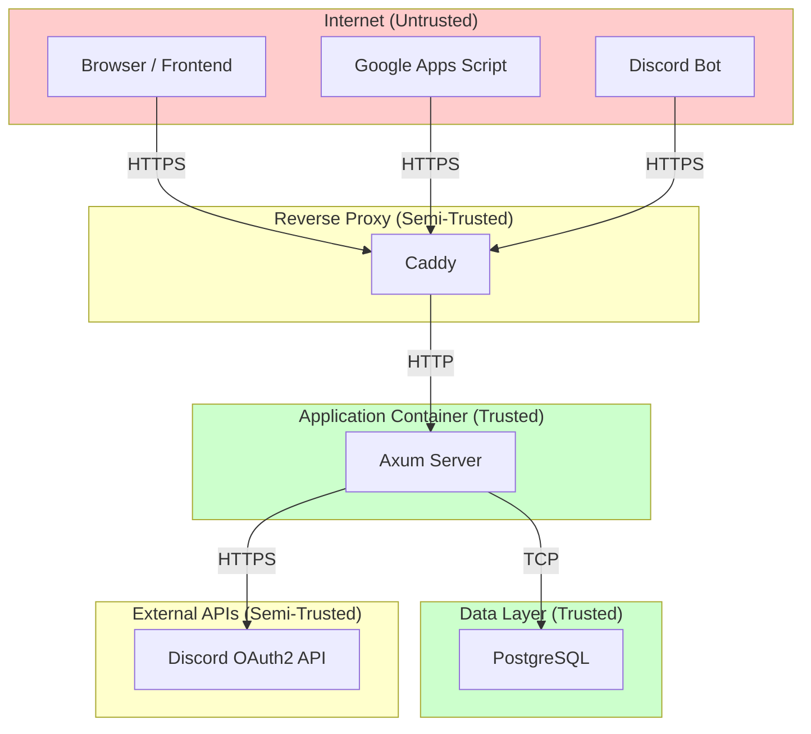

# Threat Model (STRIDE)

## Trust Boundaries



### Trust Boundary Crossings

| Boundary | Direction | Data Crossing |
|----------|-----------|---------------|
| Internet → Reverse Proxy | Inbound | HTTP requests, cookies, headers |
| Reverse Proxy → App | Inbound | Proxied HTTP, X-Forwarded-For |
| App → Database | Outbound | SQL queries, user data |
| App → Discord API | Outbound | OAuth tokens, user identity requests |
| Internet → App (System API) | Inbound | Bearer token, event/leave payloads |

---

## STRIDE Analysis

### S — Spoofing

| Threat ID | Component | Threat | Likelihood | Impact | Risk | Mitigation |
|-----------|-----------|--------|-----------|--------|------|------------|
| S-001 | OAuth2 Callback | Attacker crafts fake callback with stolen code | Medium | High | High | `state` parameter with HMAC signature + nonce in HttpOnly cookie |
| S-002 | Session Cookie | Attacker steals session cookie (XSS, network sniffing) | Low | High | Medium | HttpOnly + Secure + SameSite=Lax cookies; HSTS; no inline scripts |
| S-003 | System API | Attacker guesses or leaks SYSTEM_API_TOKEN | Low | Critical | High | 256-bit random token; constant-time comparison; rotate on suspicion; IP allowlist in Caddy (optional) |
| S-004 | API Requests | Attacker replays requests from another user | Low | Medium | Low | Session binding to user; short session TTL (7 days); no bearer tokens in URLs |

### T — Tampering

| Threat ID | Component | Threat | Likelihood | Impact | Risk | Mitigation |
|-----------|-----------|--------|-----------|--------|------|------------|
| T-001 | Profile Bio | Inject malicious HTML/JS via Markdown | High | High | High | `pulldown-cmark` → `ammonia` sanitization; post-sanitization check; strict allowlist |
| T-002 | SQL Injection | Craft malicious input to alter SQL queries | Low | Critical | Medium | SQLx compile-time query verification; all queries parameterized; zero string concatenation |
| T-003 | Request Body | Tamper with role/status fields in request body | Medium | High | High | Only accept explicitly defined fields via `serde(deny_unknown_fields)`; domain validation |
| T-004 | OAuth State | Modify `state` parameter to redirect to attacker site | Medium | High | High | HMAC-SHA256 signed state; `redirect_to` validated against allowlist |

### R — Repudiation

| Threat ID | Component | Threat | Likelihood | Impact | Risk | Mitigation |
|-----------|-----------|--------|-----------|--------|------|------------|
| R-001 | Admin Actions | Admin denies performing role change | Medium | Medium | Medium | Structured audit logging (tracing) with user_id, action, target, timestamp |
| R-002 | Reports | User denies submitting report | Low | Low | Low | `reporter_id` stored in reports table; created_at timestamp |
| R-003 | System API | External system denies sending event/leave request | Low | Medium | Low | Log all System API requests with full payload hash and timestamp |

### I — Information Disclosure

| Threat ID | Component | Threat | Likelihood | Impact | Risk | Mitigation |
|-----------|-----------|--------|-----------|--------|------|------------|
| I-001 | Error Responses | Stack traces or internal details leaked to client | Medium | Medium | Medium | 3-layer error algebra; InfraError → generic 500; never expose DB errors |
| I-002 | Database Breach | Attacker gains DB read access | Low | High | Medium | Session tokens stored as SHA-256 hashes (cannot reconstruct cookies); PII limited to Discord public data |
| I-003 | Suspended Users | Suspended user data visible via public API | Medium | Medium | Medium | All public queries filter `WHERE status = 'active'` |
| I-004 | Non-Public Profiles | Private profiles accessible via enumeration | Medium | Medium | Medium | `WHERE is_public = true` in all public queries; member detail returns 404 (not 403) for private profiles |
| I-005 | Log Injection | Attacker injects control characters into logs | Low | Low | Low | Structured JSON logging via `tracing-subscriber`; no interpolation of user input into log format strings |

### D — Denial of Service

| Threat ID | Component | Threat | Likelihood | Impact | Risk | Mitigation |
|-----------|-----------|--------|-----------|--------|------|------------|
| D-001 | All Endpoints | Request flooding | High | Medium | High | Per-layer rate limiting via `governor` (see rate-limiting.md) |
| D-002 | Auth Endpoint | Brute force OAuth flows | Medium | Low | Medium | 10 req/min/IP on auth endpoints |
| D-003 | Profile Bio | Submit extremely large Markdown for parsing | Medium | Medium | Medium | 2000 char limit enforced before parsing; request body size limit (1 MB global) |
| D-004 | Database | Connection pool exhaustion | Low | High | Medium | PgPool max_connections=20; query timeouts; connection acquire timeout |
| D-005 | System API | Flood event upserts | Low | Medium | Low | 30 req/min global rate limit on system API |

### E — Elevation of Privilege

| Threat ID | Component | Threat | Likelihood | Impact | Risk | Mitigation |
|-----------|-----------|--------|-----------|--------|------|------------|
| E-001 | Role API | Member changes own role to admin | High | Critical | Critical | Type-State Authorization at compile time; role change requires `admin`+ role; extractors enforce this |
| E-002 | Role API | Admin grants super_admin to self/others | Medium | Critical | High | Only super_admin can grant admin/super_admin; enforced in domain layer + DB check |
| E-003 | IDOR | User accesses other user's private profile via ID manipulation | Medium | Medium | Medium | `/me/profile` uses session user_id only (no user_id parameter); public endpoints filter by is_public |
| E-004 | Session Fixation | Attacker sets session cookie before user authenticates | Low | High | Medium | New session token generated on every login; old sessions not reused |
| E-005 | CSRF | Attacker tricks authenticated user into making state-changing request | Medium | High | High | Origin header validation on all POST/PUT/PATCH/DELETE in Internal API |

---

## Risk Matrix Summary

```
            Low Impact    Medium Impact    High Impact    Critical Impact
High Lkly   D-001         T-001            E-001          
Med Lkly    R-001         I-003,I-004      S-001,T-003    E-002
                          D-003            T-004,E-005
Low Lkly    I-005,R-002   D-004,S-004      S-002,I-002    T-002
                          R-003            E-004
```

All High and Critical risks have active mitigations implemented in the architecture.
