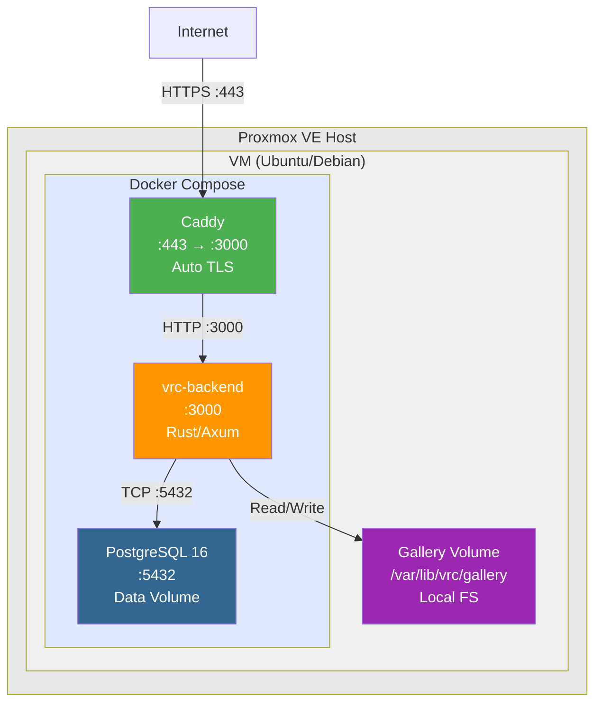

# Infrastructure Design Overview

Single-host Docker Compose deployment on a **Proxmox VE VM**, with Caddy reverse proxy and local filesystem storage. No external cloud services (R2/S3) — everything runs on owned hardware.

## Documents

| Document | Contents |
|----------|----------|
| [docker-architecture.md](./docker-architecture.md) | Dockerfile, docker-compose.yml, build optimization |
| [ci-cd/pipeline-design.md](./ci-cd/pipeline-design.md) | GitHub Actions CI/CD pipeline |
| [observability/metrics.md](./observability/metrics.md) | Metrics, logging, and monitoring design |
| [cost-estimation.md](./cost-estimation.md) | Infrastructure cost model |

## Deployment Topology



## Server Requirements (Proxmox VM)

| Resource | Minimum | Recommended |
|----------|---------|-------------|
| CPU | 1 vCPU | 2 vCPU |
| RAM | 1 GB | 2 GB |
| Disk | 20 GB (virtio) | 40 GB (virtio) |
| OS | Any Linux with Docker | Ubuntu 24.04 LTS |
| Network | Bridged NIC, public IPv4 (port-forwarded or DNAT) | + IPv6 |

Expected idle memory: ~50 MB (Axum) + ~100 MB (PostgreSQL) + ~30 MB (Caddy) ≈ 180 MB.

## Proxmox VM Configuration

```
VM ID:       <assigned>
CPU:         2 cores (host type)
RAM:         2048 MB
Disk:        40 GB (virtio-scsi, SSD-backed storage)
Network:     vmbr0 (bridged), VLAN optional
OS:          Ubuntu 24.04 LTS (cloud-init or manual)
Boot Order:  disk
QEMU Agent:  enabled
```

Port forwarding (on Proxmox host or upstream router):
- `80/tcp` → VM IP:80 (Caddy HTTP → HTTPS redirect)
- `443/tcp` → VM IP:443 (Caddy HTTPS)
- `443/udp` → VM IP:443 (HTTP/3 QUIC)
