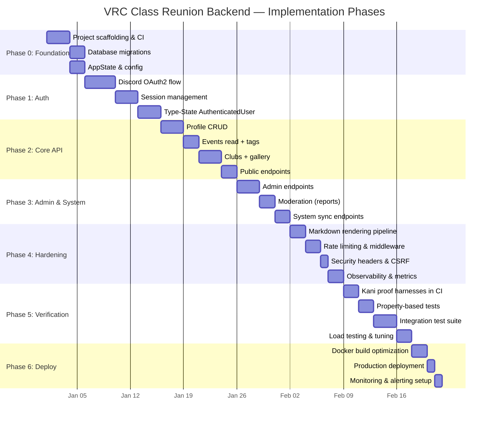

# Milestones & Phase Plan

## Phase Overview

## Phase Details

### Phase 0: Foundation (~1 week)

**Goal**: Project compiles, CI passes, database is ready.

| Deliverable | Description |
|-------------|-------------|
| Cargo workspace | `vrc-backend` + `vrc-macros` crate structure |
| CI pipeline | GitHub Actions: `cargo fmt`, `cargo clippy`, `cargo test`, `cargo sqlx prepare --check` |
| Database | All migrations applied; SQLx offline query data committed |
| AppState | Config loading from env vars, `PgPool`, `reqwest::Client` |
| Health endpoint | `GET /health` returns 200 |
| Docker dev | `docker-compose.yml` with PostgreSQL for local development |

**Exit Criteria**: `cargo build` succeeds, `cargo test` passes (with 0 tests), CI is green.

### Phase 1: Authentication (~10 days)

**Goal**: Users can log in via Discord and access authenticated endpoints.

| Deliverable | Description |
|-------------|-------------|
| `GET /api/v1/auth/login` | Redirect to Discord with HMAC-SHA256 state token |
| `GET /api/v1/auth/callback` | Exchange code, upsert user, create session |
| `POST /api/v1/internal/auth/logout` | Invalidate session, clear cookie |
| `GET /api/v1/internal/auth/me` | Return current user info |
| `AuthenticatedUser<R>` extractor | Type-state role-checking Axum extractor |
| Session middleware | Cookie validation, DB lookup, SHA-256 hashing |

**Exit Criteria**: OAuth2 login works end-to-end; `AuthenticatedUser<Member>` extractor compiles and rejects unauthenticated requests.

### Phase 2: Core API (~10 days)

**Goal**: All CRUD operations for profiles, events, clubs, and gallery.

| Deliverable | Description |
|-------------|-------------|
| `PUT /internal/me/profile` | Create/update profile with validation |
| `GET /internal/me/profile` | Read own profile |
| `GET /public/members` | List public members (paginated) |
| `GET /public/members/:id` | Single public member profile |
| `GET /public/events` | List events (paginated, filtered by tag) |
| `GET /public/events/:id` | Single event with tags |
| `GET /public/clubs` | List clubs with member counts |
| `GET /public/gallery` | List gallery images (paginated) |
| Pagination | `PageRequest` / `PageResponse<T>` implementation |

**Exit Criteria**: All public and member-facing API endpoints return correct data; pagination works.

### Phase 3: Admin & System (~7 days)

**Goal**: Admins can manage users; system sync endpoints work.

| Deliverable | Description |
|-------------|-------------|
| `PATCH /internal/admin/users/:id/role` | Role change with full authorization logic |
| `PATCH /internal/admin/users/:id/status` | User status change (suspend/activate) |
| `GET /internal/admin/reports` | List pending reports |
| `POST /internal/reports` | Create report |
| `PATCH /internal/admin/reports/:id` | Resolve report |
| `POST /system/sync/events` | Atomic event upsert from external service |
| `POST /system/sync/users/leave` | Atomic member leave (transaction) |

**Exit Criteria**: Admin role restrictions verified; member leave atomic transaction passes integration test.

### Phase 4: Hardening (~7 days)

**Goal**: Security hardening, middleware stack, observability.

| Deliverable | Description |
|-------------|-------------|
| Markdown pipeline | `pulldown-cmark` → `ammonia` → post-sanitization |
| Rate limiter | Per-IP and per-user-or-IP with `governor` |
| Security headers | CSP, X-Frame-Options, X-Content-Type-Options, HSTS |
| CSRF protection | Origin header validation for state-changing requests |
| Structured logging | JSON logs with `tracing` + `tracing-subscriber` |
| Request tracing | ULID per request in `x-request-id` header |
| Prometheus metrics | `/metrics` endpoint with request histograms |

**Exit Criteria**: Security headers present on all responses; rate limiting active; logs are structured JSON.

### Phase 5: Verification (~9 days)

**Goal**: Kani proofs pass, property tests pass, integration tests cover critical paths.

| Deliverable | Description |
|-------------|-------------|
| Kani CI | All proof harnesses pass `cargo kani` in CI |
| Property tests | All 7 proptest properties pass with 256+ cases each |
| Unit tests | 80+ unit tests covering domain logic |
| Integration tests | 20+ API integration tests with real PostgreSQL |
| Coverage report | `cargo-llvm-cov` generating coverage report |
| Load test script | `k6` or manual `wrk` script verifying P99 < 50ms |

**Exit Criteria**: All tests pass; Kani verification clean; coverage meets targets; load test confirms performance NFRs.

### Phase 6: Deployment (~4 days)

**Goal**: Production deployment working and monitored.

| Deliverable | Description |
|-------------|-------------|
| Dockerfile | Optimized multi-stage build with `cargo-chef` |
| docker-compose.yml | Production config (app + PostgreSQL + Caddy) |
| Caddyfile | TLS, reverse proxy, security headers |
| Deploy script | `docker compose pull && docker compose up -d` |
| Alerting | Basic alerts for 5xx rate, latency, disk usage |
| Runbook | Deployment, rollback, backup, and restore procedures |

**Exit Criteria**: Application running in production; health check passes; alerts are active.

## Total Estimated Duration

~48 days of focused solo development.

This estimate assumes a single developer working part-time. Phases can overlap if work is parallelized (e.g., Phase 5 verification can begin during Phase 4 hardening for components that are already complete).
